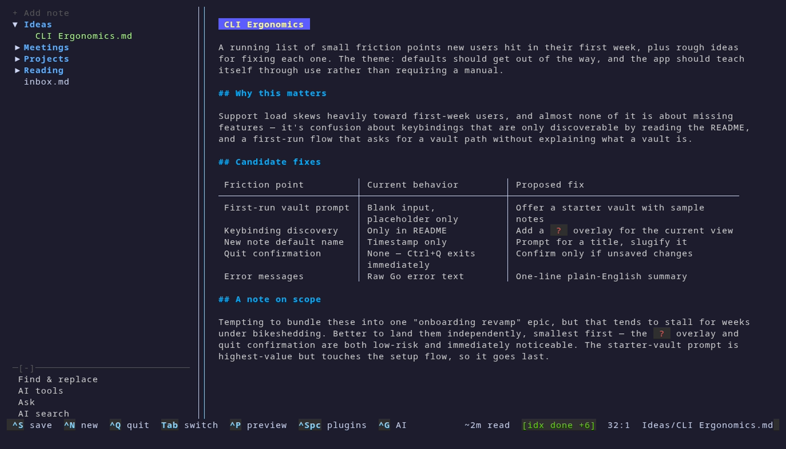
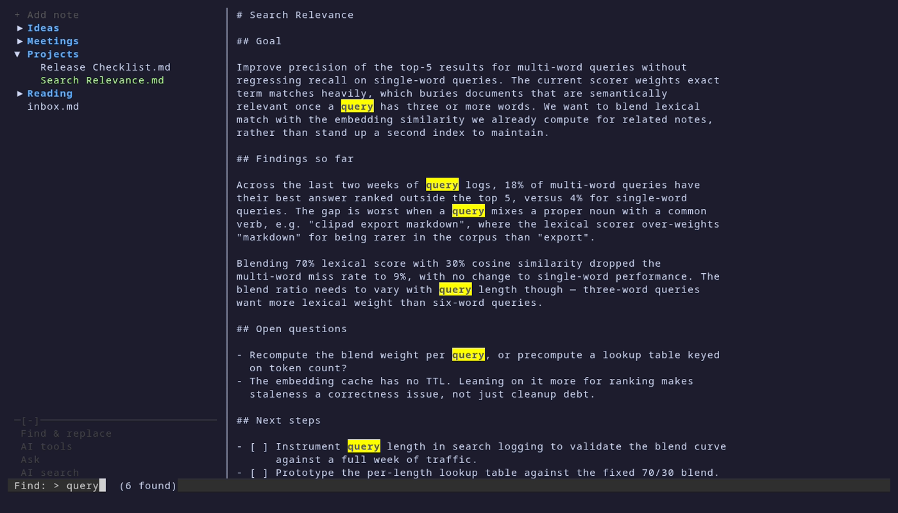
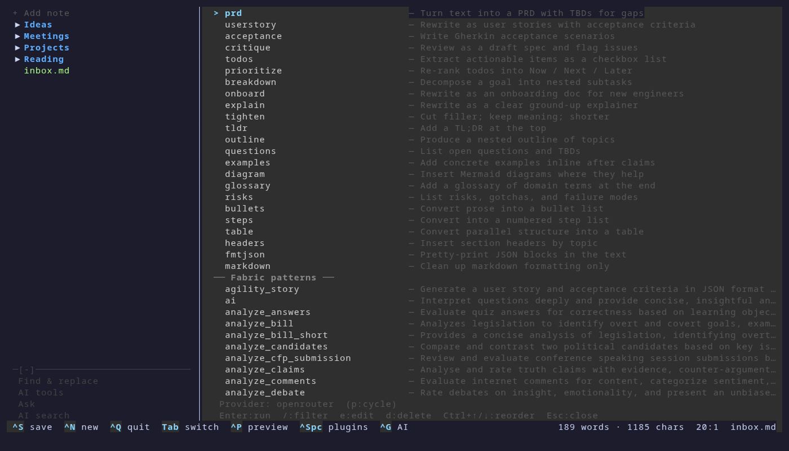

<div align="center">

# 📝 clipad

**Obsidian-flavoured note-taking for your terminal — with an AI sidekick.**

[](https://github.com/krzysztofciepka/clipad/releases/latest)
[](https://github.com/krzysztofciepka/clipad/actions/workflows/ci.yml)
[](LICENSE)


</div>

## Why clipad?

- **Your notes stay plain markdown.** A vault is just a folder of .md files — no lock-in, works alongside Obsidian or any editor.
- **A real TUI, mouse included.** File tree, editor, live preview, click, drag-select, scroll — in any terminal, over SSH too.
- **Images in the terminal.** Paste a screenshot with Ctrl+V and see actual pixels inline (kitty/Ghostty/WezTerm).
- **AI that never surprises you.** Every LLM transform lands in a side-by-side diff you accept or reject; review-style shortcuts can't touch your note at all.
- **An agent that knows your vault.** Semantic search with citations plus vault-scoped shell tools, in a chat panel.
- **One binary that updates itself.** `clipad --upgrade` fetches the latest release and swaps itself in place, checksum-verified.

## Features

### Browse and navigate

- **File tree** with nested folders, expand and collapse, and a `/` fuzzy filter.
- **Create, rename and delete** files and folders without leaving the tree.
- **Quick capture** — `Ctrl+J` appends a timestamped bullet to `inbox.md` from anywhere in the app.
- **Git sync** — `F5` pushes and pulls the vault against its git remote.
- **A clickable button bar** at the bottom of the left pane — **Find & replace**, **AI tools**, **Ask**, **AI search** — so there is no key to remember.
- **Adaptive layout** that scales down to narrow terminals, and a first-run prompt that sets up your vault.

### Write and preview

- **Markdown editor** with line numbers, undo and redo, and a preview you toggle with `Ctrl+P`.
- **Auto-copy on highlight** — selecting text with the mouse puts it on the system clipboard, confirmed by a green `Copied` flash in the status bar.
- **Split a note in two** — `Ctrl+O` moves the selected text into a new note in the same directory.
- **Mouse throughout** — click to place the cursor, drag to select, wheel to scroll, in the editor and the tree alike.



*`Ctrl+P` renders the note in place — headers, tables and inline code.*

### Find and replace

- **Live highlighting** of every match as you type, with a running count in the status bar.
- `Ctrl+R` opens it from anywhere, `Enter` moves on to the replacement, `Esc` cancels without touching the note.



*Six matches for `query`, highlighted the moment the term is typed.*

### Images in the terminal

- **Paste a screenshot** with `Ctrl+V` and see it as real pixels in both the editor and the preview.
- **Notes stay plain markdown** — the file goes to `<vault>/assets/`, the note gets an ordinary relative link. No base64, readable in any other editor.
- **Graceful fallback** — terminals without graphics support show a text chip instead, so notes stay usable over SSH and in tmux.

More in [Images](#images).

### AI shortcuts and plugins

- **23 shortcuts out of the box** — `Ctrl+G` opens the picker, seeded with a library covering requirements, todos, tech notes and formatting.
- **Two shortcut types.** `replace` rewrites the note through a side-by-side diff you accept or reject; `review` opens a read-only pane that never touches the file.
- **Selection-aware** — with text selected, only that text is sent to the model and only that text is replaced.
- **Bring your own model** — OpenRouter or OpenCode Zen, cycled with `p` right inside the picker.
- **Fabric patterns** show up next to your own shortcuts if you have [fabric](https://github.com/danielmiessler/fabric) installed, and run through your provider.
- **`/` filters** shortcuts and patterns by name, which matters once a few hundred patterns are in the list.



*The picker: your shortcut library on top, fabric patterns below, active provider in the footer.*

### An agent for your vault

- **`Ctrl+K` opens a chat panel** that both answers questions about your notes and edits them for you.
- **Semantic search with citations** — press `1`–`9` to open the note behind a citation.
- **Shell access, fenced in** — the agent's commands run with your vault as the working directory, guarded against paths that escape it.

More in [Agent](#agent).

<a id="installation"></a>

## Quick start

Download the binary from the [latest release](https://github.com/krzysztofciepka/clipad/releases/latest) and put it on your `PATH`:

```bash
chmod +x clipad-v0.0.50-linux-amd64
sudo mv clipad-v0.0.50-linux-amd64 /usr/local/bin/clipad
```

Or install with Go:

```bash
go install github.com/krzysztofciepka/clipad@latest
```

Or build from source:

```bash
git clone https://github.com/krzysztofciepka/clipad.git
cd clipad
go build -o clipad .
```

For a release build that knows its own version (so `--version` and `--upgrade` work correctly):

```bash
TAG=v0.0.50
go build -ldflags "-X main.version=$TAG" -o clipad-$TAG-linux-amd64 .
```

Then run it:

```bash
clipad
```

On first run you are prompted for your vault path — the directory where your notes live. The config is written to `~/.config/clipad/config.toml`.

To upgrade an existing installation in place:

```bash
clipad --upgrade
```

This downloads the latest release, verifies its sha256 checksum, and atomically replaces the running binary. Restart clipad afterwards. Linux/amd64 only.

<details>
<summary><strong>Table of contents</strong></summary>

- [CLI flags](#cli-flags)
- [Quick actions](#quick-actions)
- [Keybindings](#keybindings)
  - [Global](#global)
  - [File tree](#file-tree)
  - [Button bar](#button-bar)
  - [Editor](#editor)
  - [Mouse](#mouse)
- [Images](#images)
  - [How it's stored](#how-its-stored)
  - [How it renders](#how-it-renders)
  - [Editing around an image](#editing-around-an-image)
  - [Requirements](#requirements)
- [Plugins & AI](#plugins--ai)
  - [OpenRouter](#openrouter)
  - [AI shortcuts](#ai-shortcuts)
  - [Switching providers](#switching-providers)
  - [Fabric patterns](#fabric-patterns)
  - [Filtering the picker](#filtering-the-picker)
  - [The default library](#the-default-library)
- [Agent](#agent)
- [Configuration](#configuration)
- [Contributing](#contributing)
- [License](#license)

</details>

## CLI flags

| Flag | Action |
|------|--------|
| `--version` | Print the embedded version and exit |
| `--upgrade` | Fetch the latest GitHub release, verify its sha256, and replace the current binary in place. Restart clipad afterwards. Linux/amd64 only. |
| `-p`, `--preview` `<path>` | Open `<path>` in preview mode with the file tree hidden; typing switches to edit mode |
| `-n`, `--new` | Start in new-note mode (same as "+ Add note"); the file tree stays visible |

## Quick actions

Open or create a note straight from the shell. Paths may be relative or absolute and can point anywhere on the filesystem.

```bash
clipad path/to/note.md      # open in edit mode, file tree hidden
clipad -p path/to/note.md   # open in preview mode; start typing to edit
clipad --new                # start a new note in the vault root
clipad path/to/dir/         # start a new note in that directory
```

- A path to an existing file opens it; a path to a directory starts a new note in it.
- A non-existing path is created — the file, plus any missing parent directories.
- Flags must come before the path, e.g. `clipad -p note.md`.

## Keybindings

### Global

| Key | Action |
|-----|--------|
| `Ctrl+S` | Save |
| `Ctrl+N` | New note (filename derived from first line) |
| `Ctrl+J` | Quick capture — append timestamped bullet to `<vault>/inbox.md` |
| `Ctrl+O` | Move selected text to a new note in the same directory |
| `Ctrl+R` | Find & replace |
| `Ctrl+P` | Toggle markdown preview |
| `Ctrl+B` | Toggle file tree visibility |
| `F5` | Sync with git remote (push/pull) |
| `Ctrl+Q` | Quit |
| `Tab` | Switch panels |
| `Ctrl+Space` | Open plugin selector |
| `Ctrl+G` | Open AI shortcut selector |
| `/` (in picker) | Filter shortcuts and fabric patterns |
| `Ctrl+L` | Create AI shortcut |
| `Ctrl+T` | AI search — semantic search across the vault (needs `embedding_provider`) |
| `Ctrl+K` | Open the notes **agent** panel (ask about or manage your notes) |

### File tree

| Key | Action |
|-----|--------|
| `Up/Down` | Navigate (previews file content) |
| `Enter` | Open file in editor / toggle folder |
| `Right` | Open file in editor |
| `/` | Fuzzy filter |
| `Ctrl+E` | Rename file or folder |
| `Ctrl+D` | Delete file or folder |
| `Ctrl+F` | Create folder |

### Button bar

The bottom of the left pane carries a bar of clickable buttons. In ordinary use it offers **Find & replace**, **AI tools**, **Ask**, and **AI search** — the same actions as `Ctrl+R`, `Ctrl+G`, `Ctrl+K`, and `Ctrl+T`. It changes with the mode: **Approve** / **Reject** in the diff view, **Copy** in the review view, and **Input** / **Prev cite** / **Next cite** while the agent panel is open.

Click the `[-]` on the bar's top rule to minify it to a single row and give the space back to the file tree; `[+]` restores it. The file tree scrolls inside whatever room is left, so the bar is always on screen. `Ctrl+B` hides the left pane and the bar with it.

| Key | Action |
|-----|--------|
| `Tab` | Focus the bar (file tree → bar → editor) |
| `Up/Down` | Move between buttons |
| `Enter` / `Space` | Activate the focused button |
| `Esc` | Return focus to the file tree |

### Editor

| Key | Action |
|-----|--------|
| `Esc` | Return to file tree |
| `Ctrl+Z` | Undo last edit |
| `Ctrl+Shift+Z` / `Ctrl+Y` | Redo |
| `Ctrl+C` / `Ctrl+X` | Copy / cut the selection — or the image under the cursor, as an image (see [Images](#images)) |
| `Ctrl+V` | Paste — an image if the clipboard holds one, otherwise text |
| All other keys | Normal text editing |

### Mouse

| Action | Effect |
|--------|--------|
| Click in editor | Move cursor to clicked position |
| Click-drag in editor | Select text (same as shift+arrow) |
| Wheel up / down in editor | Scroll editor contents |
| Click on file in tree | Move tree cursor and open file in preview |
| Click on folder in tree | Expand / collapse the folder |
| Wheel up / down in tree | Scroll tree |
| Click a button in the bar | Run that action |
| Click `[-]` / `[+]` | Collapse / expand the button bar |

Terminal-native selection (dragging with the OS to copy outside the app) is disabled while clipad has the mouse. Most terminals still allow Shift+drag to bypass the app and use the OS selection.

## Images

Copy a screenshot to your clipboard, put the cursor on an empty line, and press `Ctrl+V`. The image is saved into your vault and rendered inline — actual pixels, in the editor and in the `Ctrl+P` preview.

### How it's stored

The image file goes to `<vault>/assets/`, named by date and a hash of its contents:

```
assets/img-2026-07-26-3f9a1c2b.png
```

The note itself only ever gets an ordinary markdown link, relative to the note:

```markdown

```

That keeps notes as plain markdown — readable in any other editor, and no base64 bloat in the semantic index. Because the filename is derived from the content, pasting the same image twice reuses the one file instead of duplicating it.

A line that is *exactly* one markdown image (`.png`, `.jpg`, `.jpeg`, `.gif`, `.webp`) is treated as an **image element**. Links you write by hand render the same way — nothing has to have been pasted by clipad.

### How it renders

Images display via the kitty graphics protocol, auto-detected from your terminal — kitty, [Ghostty](https://ghostty.org), and WezTerm all work. They're scaled to fit, preserving aspect ratio, up to 64×12 cells.

Any other terminal falls back to a text chip, so notes stay perfectly usable over SSH or in tmux:

```
🖼 image (img-2026-07-26-3f9a1c2b.png)
```

### Editing around an image

An image element behaves as a single object rather than a line of link text:

| Action | Effect |
|--------|--------|
| `Left` / `Right` | Steps over the element instead of walking through the link text |
| `Backspace` / `Delete` | Removes the whole element in one step; `Ctrl+Z` brings it back |
| `Ctrl+C` / `Ctrl+X` | Puts the *image itself* on the clipboard — paste it into any other app |

`Ctrl+C` and `Ctrl+X` only do this when the cursor sits on a lone image; a selection spanning multiple lines copies as normal markdown text.

### Requirements

Image support shells out to a system clipboard tool, so you need one of:

| Session | Tool | Package |
|---------|------|---------|
| Wayland | `wl-copy` / `wl-paste` | `wl-clipboard` |
| X11 | `xclip` | `xclip` |

If neither is installed, clipad tells you so in the status bar and `Ctrl+V` still pastes text as usual. Linux only — on other platforms `Ctrl+V` is a normal text paste.

## Plugins & AI

Plugins process your notes through external services. Press `Ctrl+Space` to open the plugin selector. Two LLM providers ship with clipad: OpenRouter and OpenCode Zen.

### OpenRouter

LLM-powered note transformation via [OpenRouter](https://openrouter.ai). Supports any model available on the platform.

On first use, you'll be prompted for:

- **API Key** — your OpenRouter API key
- **Model** — e.g. `openai/gpt-4o`, `anthropic/claude-sonnet-4`

After processing, a side-by-side diff shows the original and modified note. Press `y` to accept or `n` to reject.

Plugin config is stored at `~/.config/clipad/plugins/openrouter.toml`.

### AI shortcuts

Quick text transformations powered by your configured LLM. Press `Ctrl+G`, pick a shortcut, and the model rewrites or augments the current note. The diff view lets you accept or reject the change. Each AI shortcut has a type — `replace` rewrites the note via the diff+accept flow; `review` opens a read-only side-by-side pane you can scroll and copy from. When creating a shortcut you choose its type as the final step.

If text is selected when you trigger a plugin or shortcut, only the selected text is sent to the LLM and the diff/accept flow replaces just that selection. With no selection, the whole note is rewritten as before.

Shortcuts live in `~/.config/clipad/ai_shortcuts.toml` as `[[shortcuts]]` blocks (`name` + `prompt`). On first run the file is seeded with a default library of 23 shortcuts; you can edit, delete, or add entries freely afterward — clipad never overwrites your file.

### Switching providers

Inside the shortcut picker, press `p` to cycle the active AI provider (OpenRouter ⇄ OpenCode Zen). The current provider is shown in the picker hint line and persisted to `~/.config/clipad/config.toml` as `ai_shortcut_provider`. If you select a provider that has not been configured yet, the next shortcut run will trigger its setup wizard.

### Fabric patterns

If you have [fabric](https://github.com/danielmiessler/fabric) installed, the shortcut picker lists every pattern it finds under a `── Fabric patterns ──` heading. Clipad reads the pattern files directly — it never invokes the fabric CLI — so a pattern runs through whichever AI provider your shortcuts use, not fabric's own model config. The pattern's `system.md` becomes the system prompt and your note becomes the user message, which is how fabric itself invokes them.

Patterns always open in the read-only review pane: most of them analyse or extract rather than rewrite, so replacing your note with their output would destroy it. Press `c` in the review to copy the result. Patterns cannot be edited, deleted, or reordered from clipad — edit the files under `~/.config/fabric/patterns/` instead.

Clipad looks in `$FABRIC_CONFIG_HOME/patterns` when that variable is set, otherwise `~/.config/fabric/patterns`. Descriptions come from `pattern_explanations.md` in the same directory when fabric ships one. If fabric is not installed, the section simply does not appear.

### Filtering the picker

With a few hundred patterns in the list, press `/` inside the picker to fuzzy-filter shortcuts and patterns by name. Arrows move, `Enter` runs, `Esc` clears the filter.

### The default library

- **Requirements** — `prd`, `userstory`, `acceptance`, `critique`
- **Todos** — `todos`, `prioritize`, `breakdown`
- **Tech notes** — `onboard`, `explain`
- **Universal utilities** — `tighten`, `tldr`, `outline`, `questions`, `examples`, `diagram`, `glossary`, `risks`
- **Formatting** — `bullets`, `steps`, `table`, `headers`, `fmtjson`, `markdown`

## Agent

Press `Ctrl+K` to open the agent — a continuous chat in the right-hand panel that can both answer questions about your notes and manage them. It uses your active AI provider (OpenRouter by default) with native tool-calling and has two tools:

- **search_vault** — semantic search over your notes (cited inline; press `1`–`9` to open a citation). Requires `embedding_provider` configured; before each search it prunes index entries for files that no longer exist.
- **bash** — runs shell commands (cd, mv, cp, cat, sed, awk, …) in your vault to inspect and edit notes. Commands run with the vault as the working directory and a best-effort guard that blocks paths escaping the vault and `sudo`.

Example: *"rename all `Task <N>` files so N is sequential starting from 1, only in the Prywatne directory."*

Slash commands: `/clear` (reset the conversation), `/exit` (close), `/model` (show the model), `/help`. Press `Esc` to stop a run.

The agent's bash commands run automatically and are scoped to the vault by working directory plus a heuristic guard — this is a safety rail against accidents, not a security sandbox.

## Configuration

| File | Purpose |
|------|---------|
| `~/.config/clipad/config.toml` | Vault path; optional `inbox_path` override (defaults to `inbox.md` relative to the vault — accepts vault-relative subpaths, absolute paths, and `~`-prefixed paths) |
| `~/.config/clipad/plugins/*.toml` | Plugin settings |

`config.toml` also holds `ai_shortcut_provider` (see [Switching providers](#switching-providers)) and `embedding_provider` (see [Agent](#agent)), both written or read as those features are used.

Respects `$XDG_CONFIG_HOME` if set.

## Contributing

Issues and pull requests are welcome — bug reports, new AI shortcuts for the default library, and terminal compatibility fixes especially.

clipad is a single Go module built on the [Charm](https://charm.sh) ecosystem — Bubble Tea, Lipgloss and Glamour — with no code generation and no build tooling beyond the Go toolchain. See [CONTRIBUTING.md](CONTRIBUTING.md) for the development setup and how to run the tests.

## License

MIT — see [LICENSE](LICENSE).
